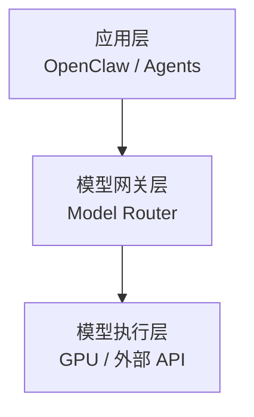
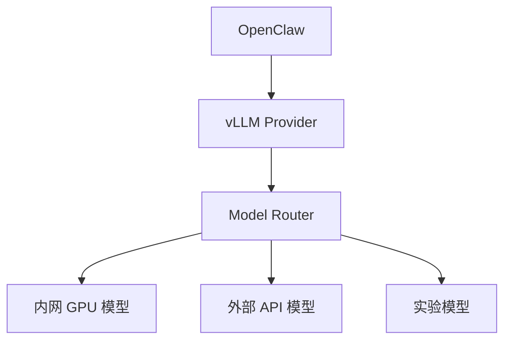

# 🚀 OpenClaw LLM Infrastructure


> LLM Gateway Architecture  
> Built with OpenClaw + vLLM Provider + Model Router

---

# 📐 一、架构总览

## 🔹 三层模型架构



---

## 🔹 实际部署拓扑



---

# 🧠 二、核心设计理念

## 1️⃣ 协议抽象层

统一使用 OpenAI Schema：

```bash
POST /v1/chat/completions
```

优势：

- 供应商可替换
- 应用层零耦合
- 易扩展
- 易升级
- 支持多模型并存

---

## 2️⃣ 模型别名机制（Alias）

| 虚拟模型名 | 实际模型 |
|------------|----------|
| openai/gpt-4o | 内网 GPU |
| openai/o1 | 外部 API |
| openai/gpt-4o-mini | 小模型 |

实际模型由 Router 控制。

---

# 🏗 三、组件职责

## 🔹 OpenClaw

- Prompt 构造
- Agent 管理
- Session 管理
- 工作流控制

## 🔹 vLLM Provider

- OpenAI-compatible 接口
- 自定义 Base URL

## 🔹 Model Router

- 多模型路由
- rewriteModel 映射
- 统一鉴权
- 故障回退

## 🔹 模型执行层

- 内网 GPU
- 外部 API
- 实验模型

---

# 🔄 四、零停机升级

1. 修改 rewriteModel  
2. 重启 Router  
3. 应用层无需改动  

---

# 🚀 五、快速启动

### 首次构建

```bash
docker compose up -d --build
```

### 日常启动

```bash
docker compose up -d
```

### 仅更新 Router

```bash
docker compose up -d --force-recreate model-router
```

---

# 🛠 六、运维命令速查表

| 操作 | 命令 |
|------|------|
| 启动所有服务 | `docker compose up -d` |
| 首次构建 | `docker compose up -d --build` |
| 强制重建 Router | `docker compose up -d --force-recreate model-router` |
| 重建所有服务 | `docker compose up -d --force-recreate` |
| 查看日志 | `docker compose logs -f` |
| 查看服务状态 | `docker compose ps` |
| 停止服务 | `docker compose down` |
| 删除容器和网络 | `docker compose down -v` |

---

# 📌 七、推荐使用场景

### 场景 1：第一次部署

```bash
docker compose up -d --build
```

### 场景 2：正常重启

```bash
docker compose up -d
```

### 场景 3：修改 MODEL_ROUTES_JSON

```bash
docker compose up -d --force-recreate model-router
```

### 场景 4：修改 docker-compose.yml

```bash
docker compose up -d --force-recreate
```

### 场景 5：修改 Dockerfile

```bash
docker compose up -d --build
```

---

# 🔐 八、安全建议

- 所有 Key 使用 `.env`
- 不提交真实 IP
- 生产环境使用：

```bash
OPENCLAW_GATEWAY_BIND=loopback
```

---

