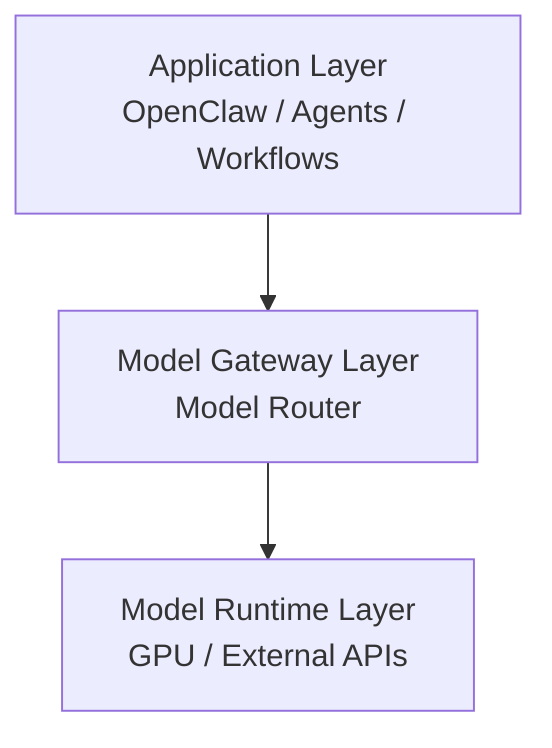
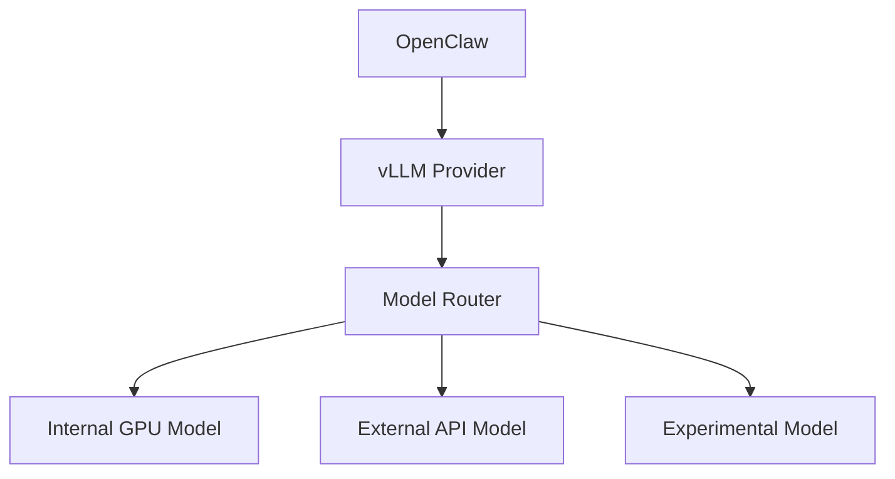
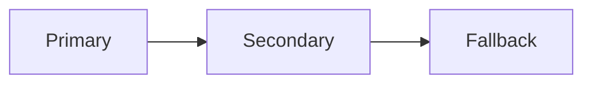

# 🚀 OpenClaw Enterprise LLM Infrastructure


> Enterprise-Grade LLM Gateway Architecture  
> Built with OpenClaw + vLLM Provider + Model Router

---

# 📐 Architecture Overview

## 🔹 Three-Layer Model



---

## 🔹 Concrete Deployment Structure



---

# 🧠 Design Philosophy

## Protocol Abstraction

All upstream communication uses **OpenAI-compatible schema**:

```http
POST /v1/chat/completions
```

Benefits:

- Unified interface
- Vendor independence
- SDK ecosystem compatibility
- Lower maintenance cost
- Easy model replacement

The Router handles:

- Model rewriting
- Authentication
- Routing logic
- Protocol translation (if needed)

---

# 🏗 Infrastructure Layers

## 1️⃣ Application Layer

- OpenClaw
- Agents
- Workflows
- RAG Pipelines

Responsibilities:

- Generate prompts
- Consume responses
- Manage sessions

> This layer never directly depends on real model vendors.

---

## 2️⃣ Model Gateway Layer (Router)

Core Responsibilities:

- Model alias management
- Multi-vendor routing
- Authentication unification
- Logging
- Cost tracking
- Rate limiting
- Circuit breaker logic
- A/B testing

This is the strategic control point of the system.

---

## 3️⃣ Model Runtime Layer

Includes:

- vLLM (local GPU)
- OpenAI
- Claude
- Gemini
- Any HTTP inference engine

This layer only performs inference.

---

# 🔁 Multi-Model Routing (Different IP / Different Vendor)

## Example Scenario

| Model | Location | Base URL |
|--------|----------|----------|
| Model A | Internal GPU | http://10.128.200.101:9999/v1 |
| Model B | External API | https://api.vendor.com/v1 |
| Model C | Experimental | http://10.128.200.102:8000/v1 |

---

## 🔧 Router Configuration Example

<details>
<summary>Click to expand MODEL_ROUTES_JSON example</summary>

```json
MODEL_ROUTES_JSON=[
  {
    "match":"openai/gpt-4o",
    "upstream":"${MODEL_A_BASE}",
    "auth":"bearer:${MODEL_A_KEY}",
    "rewriteModel":"${MODEL_A_NAME}"
  },
  {
    "match":"openai/o1",
    "upstream":"${MODEL_B_BASE}",
    "auth":"bearer:${MODEL_B_KEY}",
    "rewriteModel":"${MODEL_B_NAME}"
  },
  {
    "match":"openai/gpt-4o-mini",
    "upstream":"${MODEL_C_BASE}",
    "auth":"bearer:${MODEL_C_KEY}",
    "rewriteModel":"${MODEL_C_NAME}"
  },
  {
    "match":"*",
    "upstream":"${MODEL_A_BASE}",
    "auth":"bearer:${MODEL_A_KEY}",
    "rewriteModel":"${MODEL_A_NAME}"
  }
]
```

</details>

---

# 🔄 Zero-Downtime Upgrade Strategy

To upgrade a model:

1. Modify `rewriteModel` in router config
2. Restart router
3. OpenClaw remains untouched

No application changes required.

---

# 🛡 Reliability & Governance

## Observability

- Structured logging
- Token usage metrics
- Per-model cost tracking
- Latency monitoring

## Failover Strategy



## Retry Policy

- Exponential backoff
- Circuit breaker logic

---

# 🔐 Security Best Practices

- Store API keys in environment variables
- Avoid hardcoded secrets
- Use Docker network isolation
- Restrict router to internal network
- Rotate keys regularly

---

# 📊 Infrastructure Maturity

This system qualifies as:

**Enterprise-Grade LLM Infrastructure Platform**

Features:

- ✅ Protocol abstraction
- ✅ Multi-model routing
- ✅ Vendor decoupling
- ✅ Zero-downtime upgrade
- ✅ Extensible architecture
- ✅ Production-ready Docker deployment

---

# 🚀 Future Evolution

Possible Enhancements:

- Intelligent model selection engine
- Cost-aware routing
- Dynamic load balancing
- Distributed router cluster
- Multi-region deployment
- SLA enforcement layer
- GPU auto-scaling
- Centralized AI gateway platform

---

# 📌 Summary

This is no longer simple API integration.

This is a modular, extensible, vendor-agnostic LLM infrastructure system.

---

# 📂 Suggested Repository Structure

```
openclaw-llm-infra/
├── README.md
├── docker-compose.yml
├── .env.example
├── docs/
│   ├── architecture.md
│   ├── routing.md
│   ├── security.md
│   └── upgrade.md
```

---

# 👨‍💻 Maintainer Notes

- Always route OpenClaw → vLLM → Router
- Never let OpenClaw directly hit external vendors
- Keep model names virtual at the application layer
- Treat models as replaceable resources

---
