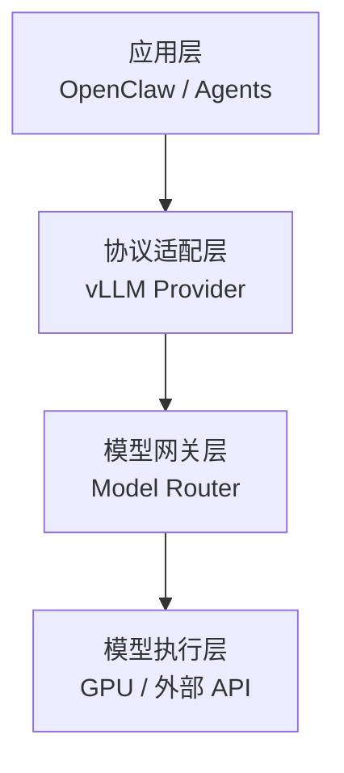

# 📐 架构设计说明

本项目采用企业级三层 LLM 架构设计：

- 应用层（Application Layer）
- 模型网关层（Gateway Layer）
- 模型执行层（Runtime Layer）

---

# 一、整体架构图



---

# 二、层级职责

## 1️⃣ 应用层（Application Layer）

组件：

- OpenClaw
- Agent 系统
- 工作流
- RAG 系统

职责：

- 构造 Prompt
- 管理 Session
- 消费模型响应

⚠ 不直接依赖真实模型供应商。

---

## 2️⃣ 协议适配层（vLLM Provider）

作用：

- 提供 OpenAI-compatible 接口
- 允许自定义 Base URL
- 将请求转发至 Router

统一协议：

```
POST /v1/chat/completions
```

---

## 3️⃣ 模型网关层（Model Router）

核心职责：

- 模型别名管理（Alias）
- 多模型分流
- rewriteModel 映射
- 统一鉴权
- 成本统计
- 熔断机制
- A/B 测试支持

这是系统的控制中枢。

---

## 4️⃣ 模型执行层（Runtime）

包括：

- 内网 GPU 模型（vLLM / Qwen）
- 外部 API（OpenAI / Claude / 其他）
- 实验模型

仅负责文本生成。

---

# 三、设计原则

1. 上层永远使用“虚拟模型名”
2. 所有模型必须经过 Router
3. 使用 OpenAI Schema 作为内部统一协议
4. 模型必须可替换
5. 升级必须支持零停机

---

# 四、成熟度等级

当前架构属于：

企业级 LLM 网关架构（可扩展 / 可维护 / 可治理）
