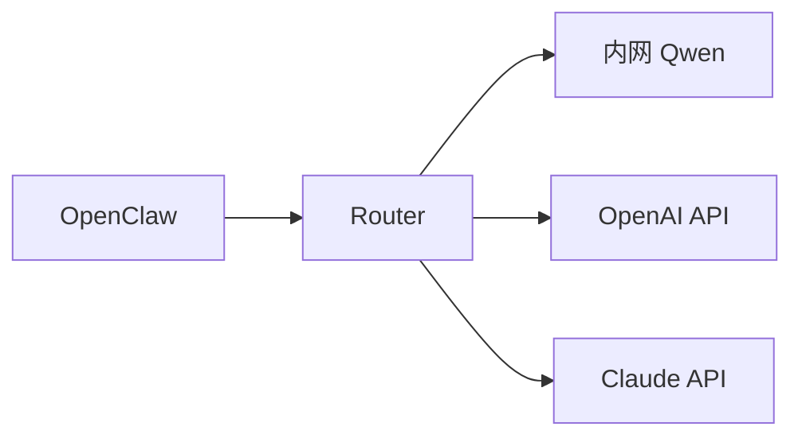

# 🔁 模型路由策略说明

本系统通过 Model Router 实现多模型、多供应商分流。

---

# 一、基础路由逻辑

Router 根据：

- match（虚拟模型名）
- upstream（真实模型地址）
- rewriteModel（真实模型名）
- auth（鉴权方式）

进行转发。

---

# 二、典型场景

## 场景 1：不同 IP 模型

| 虚拟模型 | 实际模型 |
|----------|----------|
| openai/gpt-4o | 内网 GPU |
| openai/o1 | 外部 API |
| openai/gpt-4o-mini | 小模型 |

---

## 场景 2：不同供应商



---

# 三、MODEL_ROUTES_JSON 示例

```
MODEL_ROUTES_JSON=[
  {
    "match":"openai/gpt-4o",
    "upstream":"http://INTERNAL_IP:9999/v1",
    "auth":"bearer:INTERNAL_KEY",
    "rewriteModel":"Qwen3-30B"
  },
  {
    "match":"openai/o1",
    "upstream":"https://api.vendor.com/v1",
    "auth":"bearer:EXTERNAL_KEY",
    "rewriteModel":"gpt-4o"
  },
  {
    "match":"*",
    "upstream":"http://INTERNAL_IP:9999/v1",
    "auth":"bearer:INTERNAL_KEY",
    "rewriteModel":"Qwen3-30B"
  }
]
```

---

# 四、最佳实践

- 虚拟模型名稳定
- 实际模型名可变
- 升级只改 rewriteModel
- .env 中 JSON 必须单行
- 所有 Key 使用环境变量

---

# 五、未来扩展

- Prompt 长度分流
- 成本感知分流
- 智能模型选择引擎
- 动态权重负载均衡
